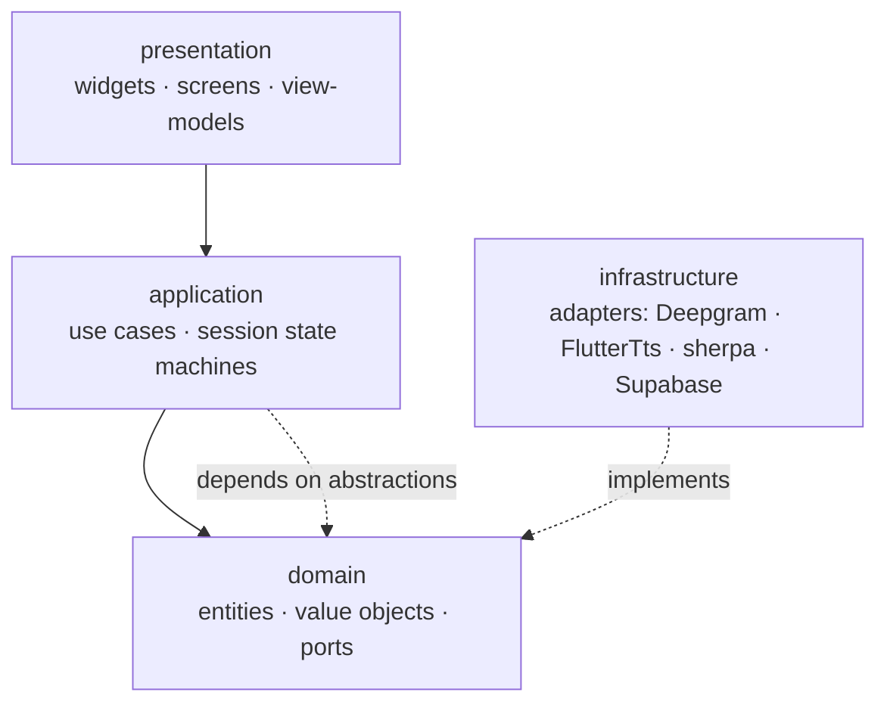
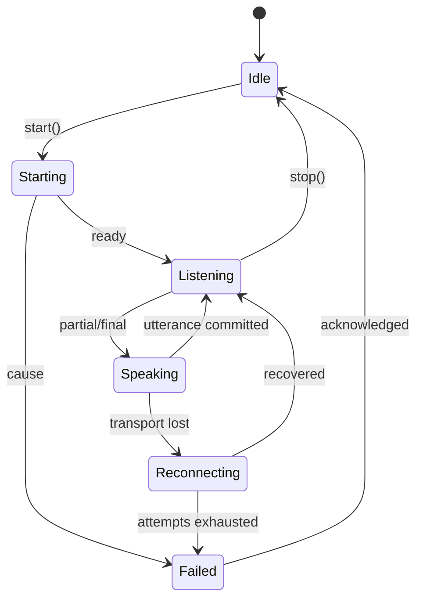

# HumSukhan — Architecture (proposed redesign)

**Status:** a design I would build to, not a description of the current tree.
`humsukhan/FEATURE_MODULE_ARCHITECTURE.md` describes the as-built structure.

Every rule below traces to a defect that actually shipped. The provenance is
listed in §9 so nothing here reads as taste.

---

## 1. What went wrong, and the principle each failure implies

| Shipped defect | Principle it forces |
|---|---|
| `ConversationProvider` overwrote captions with `DeepgramTranscriptionService.lastFinalTranscript` — a singleton owned by a *different* recognizer that Everyday Mode never starts | **No ambient global state.** A component may only read data it was given. |
| Two `SpeechProvider` classes; the app used one, two regression tests validated the other | **One implementation per role**, and tests bind to the wired one. |
| `onDone: () {}` on the recognizer sockets — a dropped connection left the UI reading "Listening…" forever | **Every stream terminus is handled.** Sessions have explicit health. |
| Capability probe called `speak('.')` — audible, on every resume | **Diagnostics must not be user-perceivable.** |
| Corrupt model download became a permanent trap (existence-only readiness check) | **Readiness means usable, not present.** Failures must be self-healing. |
| `generateInsights()` returned early on 5 different failures with no state change | **Async work is a state machine**: idle/loading/success/failure(reason). |
| Silence timer wired to `_stopListening()` — closed the mic after one utterance | **Name the domain event** (utterance ended ≠ session ended). |
| `<monochrome>` referenced a resource that didn't exist; pushed straight to `main` | **CI gates the default branch.** |
| Stale negative capability cache never rechecked per language | **Negative caches expire.** |

---

## 2. Layering



One rule, enforced by lint: **dependencies point inward.** `domain` imports
nothing from Flutter or any plugin. That is what makes the speech stack testable
without a device — the thing this codebase most lacked.

## 3. Module layout

```
lib/
  core/           # tokens, theme, l10n, result types, logging — no feature logic
  domain/
    speech/       # Utterance, Turn, LanguageTag, SttPort, TtsPort, CapabilityPort
    conversation/ # Conversation, Caption, TurnPolicy
    professional/ # Session, Insight, RetentionPolicy
    environment/  # SoundEvent, Severity, DetectorPort
  application/
    conversation/ # ConversationSession (state machine)
    professional/ # SessionRecorder, InsightService
    environment/  # MonitoringController
  infrastructure/
    stt/          # DeepgramSttAdapter, PlatformSttAdapter, SherpaSttAdapter
    tts/          # NativeTtsAdapter, CloudTtsAdapter
    model/        # ModelRepository (download, verify, heal)
    backend/      # SupabaseClient wrappers
  features/       # UI per pillar: conversation/ professional/ environment/ settings/ auth/
```

A feature may import `core`, `domain`, `application`, and its own folder. It may
**not** import `infrastructure` or another feature. Composition happens once, at
the root.

## 4. Speech: ports and one state machine

The single biggest structural change. Today speech logic is spread across
`ConversationEngine`, `EverydaySpeechProvider`, `EverydayBilingualSttService`,
`EnhancedSpeechProvider` and `ResilientTtsProvider`, each holding a slice of the
truth. Replace with **narrow ports + one owner of session state.**

```dart
abstract interface class SttPort {
  Stream<SttEvent> get events;            // Partial | Final | Ended(reason) | Failed(cause)
  Future<Result<Unit, SttFailure>> start(SttRequest request);
  Future<void> stop();
}

abstract interface class TtsPort {
  Future<Result<Unit, TtsFailure>> speak(Utterance utterance);
  Future<void> stop();
}

abstract interface class SpeechCapabilityPort {
  Future<Capability> stt(LanguageTag language);
  Future<Capability> tts(LanguageTag language);   // silent probe only
}
```

`SttEvent` **must** include `Ended` and `Failed`. The dead-session bug existed
because the old stream had no way to say "I stopped".



`Reconnecting` and `Failed` are *first-class states the UI renders*, not internal
booleans. That single change makes "it silently stopped" impossible to express.

**Turn policy is a pure function** — the part that broke twice:

```dart
sealed class TurnSignal { }          // SpeechDetected | SilenceElapsed | UserStopped
TurnDecision decide(TurnState s, TurnSignal e);  // Continue | CommitUtterance | EndSession
```

Pure, so "a pause commits an utterance but does not close the microphone" and
"finals accumulate within a turn" are unit tests with no plugins involved.

## 5. Errors: no nulls, no silent returns

```dart
sealed class Result<T, E> { }
final class Ok<T, E> implements Result<T, E> { final T value; }
final class Err<T, E> implements Result<T, E> { final E error; }
```

Failures are typed and carry user-facing copy plus a remedy:

```dart
sealed class SpeechFailure {
  String get message;       // what happened
  String? get remedy;       // what the user can do
  bool get isRecoverable;
}
```

**Banned:** returning `null` to mean failure; `catch (_) {}`; early `return` from
an async command without recording an outcome. Enforced by review + lint.

## 6. Capability detection

- Probes are **silent by construction** — the TTS adapter mutes before probing,
  and the port's contract says so.
- Results cached per `(platform, osVersion, engineId, language)`. Adding
  `engineId` means installing a new TTS engine invalidates the cache.
- Negative results carry a TTL and are rechecked on resume; positives are reused.
- `Capability` is `available | unavailable(reason) | unknown` — never a bare bool,
  so "we haven't checked" is distinguishable from "checked, absent".

## 7. Model lifecycle (environmental)

`ModelRepository` owns download → **verify** → install → heal:

- verify size against `Content-Length` **and** a pinned checksum;
- `isReady` means *loaded by the tagger at least once*, not "two files exist";
- a load failure quarantines the artefact and re-downloads;
- state is observable: `absent · downloading(progress) · verifying · ready · failed(reason)`.

Ship the model **in the APK** (or as an install-time asset pack) rather than a
runtime fetch from a third-party host. A first-run network dependency for a
safety feature is the wrong trade; the runtime download stays only as an updater.

## 8. State management & DI

Riverpod, for three reasons this codebase needed: compile-time-checked
dependencies (no `context.read` in `initState` ordering hazards), trivial
override of a port with a fake in tests, and `AsyncValue` making
loading/error/data states unrepresentable-as-blank.

No stateful singletons. Lifetime is owned by the container, so "notified after
dispose" and cross-session state leakage stop being possible.

## 9. Testing strategy

| Layer | How | Device needed |
|---|---|---|
| Domain (turn policy, language classification, normalizers) | Pure unit | No |
| Application (session state machine, insight service) | Fake ports | No |
| Adapters | Contract tests against a fake WS/plugin | No |
| Presentation | Widget tests with overridden providers | No |
| End-to-end | `integration_test` on a real device | **Yes** |

Two rules learned the hard way:
1. **A regression test must be shown to fail on the unfixed code.** Three of the
   v2.4.1 tests were verified that way; the fourth was documented as not
   reproducing the original condition instead of being claimed as proof.
2. **Tests import the wired implementation.** A test that constructs a class the
   app never builds is worse than no test — it is false confidence.

## 10. Platform configuration as a checklist

Android package visibility, foreground-service types and icon layers are
invisible until they fail on a device. Keep an explicit, reviewed list:
`RECORD_AUDIO`, `FOREGROUND_SERVICE_MICROPHONE`, `POST_NOTIFICATIONS`;
`<queries>` for **both** `TTS_SERVICE` *and* `RecognitionService`; adaptive icon
with all three layers present; every `@mipmap/@drawable` reference resolving.

## 11. Delivery

- `main` is protected. No direct pushes — the broken-icon outage came in that way.
- CI gates: `dart format --set-exit-if-changed`, `flutter analyze --fatal-infos`,
  `flutter test --coverage`, `flutter build apk --debug`.
- Release is tag-driven, version/tag consistency asserted in the workflow, APK
  existence and non-zero size asserted before publish (already true today).
- Secrets only in Edge Functions. No third-party API key reaches the client —
  the current Deepgram ephemeral-token design is correct and should be kept.

---

## 12. What I would keep

Not everything needs changing. These are good and survive the redesign:

- **Server-side key custody** via Supabase Edge Functions with short-lived tokens.
- **Ephemeral, on-device environmental classification** — no audio leaves the device.
- **Per-user scoping of local storage** and rebuilding the provider tree on user
  change; cross-user leakage is structurally prevented.
- **The language policy module** — disjoint Unicode ranges, Devanagari stripped
  before routing. It is small, pure and well tested.
- **Generation counters** for cancelling superseded async speech work.
- **Retention policy** with visible expiry.
